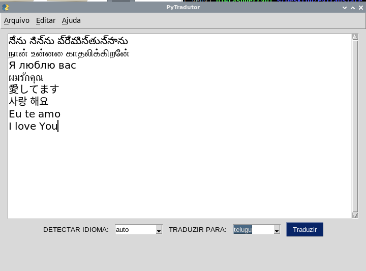

# PyTranslator

## O Que é e para que serve o PyTranslator?

**PyTranslator** é simultaneamente um editor e tradutor de texto em com interface gráfica que usa a Biblioteca [deep-translator](https://pypi.org/project/deep-translator/)  para traduzir textos escrito 100% em Python. 

A interface gráfica é possível graças a biblioteca [PySimpleGui](https://pypi.org/project/PySimpleGUI/).

Neste aplicativo configurei o software para traduzir utilizando o Google Translator por ser gratuito e ilimitado. Mas é possível configurar o **deep-translator** para usar outros serviços como: MicrosoftTranslator, PonsTranslator, LingueeTranslator, MyMemoryTranslator, YandexTranslator, PapagoTranslator, DeepL, QCRI, single_detection, batch_detection. Você pode modificar isso após instalar o PyTranslator.

**PyTranslator** permite editar, traduzir, salvar  e abrir textos planos como *.txt, *.md, etc...

## Como instalar o PyTranslator?

Para instalar o **PyTranslator** clone o projeto utilizando o seguinte comando no terminal:
 
~~~python

git clone https://github.com/elizeubarbosaabreu/PyTranslate.git

~~~
 
Em seguida crie um ambiente virtual para instalar as dependências:
 
~~~python

cd PyTranslate
python3 -m venv .venv
source ./.venv/bin/activate

~~~

Se estiver no Windows talvez os comandos sejam esses:
 
~~~python

cd PyTranslate
python -m venv .venv
source .\.venv\Scripts\activate.bat

~~~

Agora Instale as dependencias:
 
~~~python

pip install -r requirements.txt

~~~

Agora só rodar o comando:
 
~~~python

python app.py

~~~

## Dicas:
Ainda dentro da env instale o pyinstaller e rode os comandos abaixo para transformar o app.py em executável. 
 
~~~python

pip install pyinstaller
pyinstaller app.py

~~~